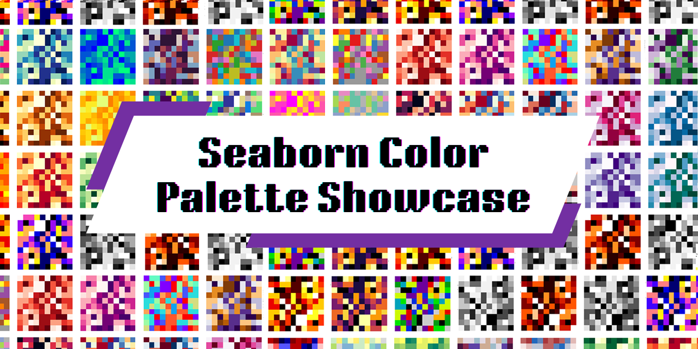

This repository includes nearly all built-in color palettes available for use in your plots. I have compiled a comprehensive list and showcase to save you the time and effort of searching for them each time you need to use them.

Check out the palettes here: [All_color_palettes.pdf](All_color_palettes.pdf) & [All_color_palettes.png](All_color_palettes.png).

A total of **164** palettes are showcased (82 standard and 82 reversed), although a few, such as `flag`, `prism`, `tab20`, `tab20b`, and `tab20c` are not included. These omitted palettes didn't suit the showcasing data. For instance, the `flag` palette comprises just a few distinct colors, which makes it unsuitable for visualizing categorical data with up to 10 unique categories, as required by the showcase.

The color palettes are sorted in alphabetical order, followed by the same palettes in reversed order, denoted by `_r` at the end of their names.

For those looking to use a specific type of color palette, here are some categories with the palettes to facilitate easier searching. Note that categorization was made with the help of [Seaborn's documentation](https://seaborn.pydata.org/tutorial/color_palettes.html), my pattern matching brain, and AI - so some may not be accurate. Additionally, you can define custom palettes in your visualizations using lists of colors in various formats (RGB tuples, hex strings, etc.).

### Sequential Color Palettes:

- `afmhot`: From black to white, with shades of red.
- `autumn`: Red to yellow.
- `binary`: Sequential palette emphasizing monochrome.
- `Blues`: Shades of blue, from light to dark.
- `bone`: Sequential palette emphasizing grayscale.
- `BuGn`: Blue to green.
- `BuPu`: Blue to purple.
- `cividis`: Perceptually uniform shades of blue-green and yellow.
- `CMRmap`: Black to purple to red to yellow to white.
- `cool`: Sequential palette emphasizing cool colors.
- `copper`: Sequential palette with metallic hues.
- `crest`: Light green to dark green.
- `cubehelix`: Sequential palette with varying saturation and lightness
- `flare`: Light orange to darker, reddish colors.
- `gist_earth`: Sequential palette emphasizing various shades of brown, green, and blue, resembling natural landscapes and terrain.
- `gist_gray`: Sequential palette emphasizing grayscale.
- `gist_heat`: Sequential palette emphasizing warm colors.
- `gist_yarg`: Sequential palette emphasizing grayscale.
- `GnBu`: Green to blue.
- `Greens`: Shades of green, from light to dark.
- `Greys`: Shades of gray ranging from white to black.
- `hot`: Transitions from black to red and then to yellow, mimicking the colors of a hot metal object.
- `icefire`: Transitions smoothly from deep blues to vibrant greens and then to fiery oranges and reds.
- `inferno`: Perceptually uniform shades of orange and yellow.
- `magma`: Perceptually uniform shades of purple and green.
- `mako`: Transitions smoothly through a range of colors from deep blues and greens to warm yellows and oranges.
- `Oranges`: Shades of orange, from light to dark.
- `OrRd`: Orange to red.
- `plasma`: Perceptually uniform shades of purple and yellow-green.
- `PuBu`: Purple to blue.
- `PuBuGn`: Purple to blue to green.
- `PuRd`: Purple to red.
- `Purples`: Shades of purple, from light to dark.
- `RdPu`: Red to purple.
- `Reds`: Shades of red, from light to dark.
- `rocket`: Emphasizing a change from dark to bright colors.
- `terrain`: Resembles natural landscapes, with shades of green, brown, and blue.
- `viridis`: Perceptually uniform shades of green and blue.
- `winter`: Dark blue to light blue and white.
- `Wistia`: Shades of yellow and brown.
- `YlGn`: Yellow to green.
- `YlGnBu`: Yellow to green to blue.
- `YlOrBr`: Yellow to orange to brown.
- `YlOrRd`: Yellow to orange to red.

### Diverging/Cyclic Color Palettes:

- `BrBG`: Brown to blue-green.
- `bwr`: Blue and red, with white in the middle.
- `coolwarm`: Red to blue.
- `hsv`: Hue, saturation, value color wheel.
- `PiYG`: Pink to yellow-green.
- `PRGn`: Purple to green.
- `PuOr`: Purple to orange.
- `RdBu`: Red to blue.
- `RdGy`: Red to gray.
- `RdYlBu`: Red to yellow to blue.
- `RdYlGn`: Red to yellow to green.
- `seismic`: Blue to white to red, emphasizing a change from one color to another with a neutral midpoint.
- `Spectral`: Red to yellow to green to blue, often used for rainbow-like plots.
- `twilight_shifted`: The same as twilight but 'darker'.
- `twilight`: White to blue to brown to white.

### Qualitative/Categorical Color Palettes:

- `Accent`: Vivid colors, good for categorical data.
- `Dark2`: Set of dark colors.
- `gnuplot`: Tableau 10 colors.
- `gnuplot2`: Tableau 18 colors.
- `Paired`: Paired colors, good for categorical data.
- `Pastel1`: Light pastel shades.
- `Pastel2`: Slightly darker pastel shades.
- `Set1`: Set of colors suitable for categorical data.
- `Set2`: Set of colors, different from Set1.
- `Set3`: Set of colors, different from Set1 and Set2.
- `spring`: Bright and vibrant colors: shades of green, yellow, and pink.
- `summer`: Warm and sunny colors such as yellow, orange, and green.
- `tab10`: Tableau 10 colors.
- `vlag`: Flag-like color schemes: red to blue with white in the middle.

### Miscellaneous Color Palettes:

These palettes include specific themes or variations that don't fit neatly into the above categories.

- `brg`: Not clearly categorized, but often used for rainbow-like plots.
- `gist_ncar`: Not clearly categorized, but often used for geographic data.
- `gist_stern`: Not clearly categorized, can be used for perceptually uniform grayscale plots.
- `gist_rainbow`: Not clearly categorized, but often used for rainbow-like plots.
- `nipy_spectral`: Not clearly categorized, but often used for rainbow-like plots.
- `ocean`: Not clearly categorized, but often used for oceanographic data.
- `rainbow`: Not clearly categorized, but often used for rainbow-like plots.
